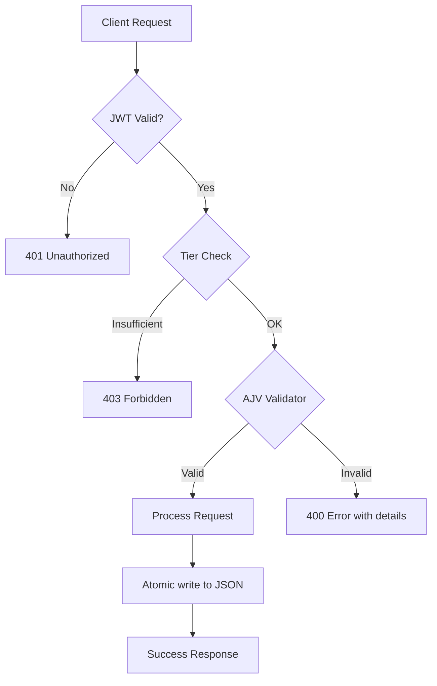

# API

REST API endpoints and validation rules. All endpoints except the four auth endpoints require authentication via JWT
cookie.

## Endpoints

### Public (no auth required)

| Method | Path                       | Purpose                          |
|--------|----------------------------|----------------------------------|
| GET    | `/api/registration-status` | Check if registration is enabled |
| POST   | `/api/register`            | Register a new user              |
| POST   | `/api/login`               | Log in and receive JWT cookie    |
| POST   | `/api/logout`              | Clear JWT cookie                 |

Auth endpoints (`/api/register`, `/api/login`) are rate-limited to 20 requests per 15 minutes.

### Authenticated (any logged-in user)

| Method | Path                              | Purpose                                  |
|--------|-----------------------------------|------------------------------------------|
| GET    | `/api/me`                         | Current user info (username, tier)       |
| GET    | `/api/settings`                   | Application settings                     |
| GET    | `/api/recipes`                    | Recipe list (valid recipes only)         |
| GET    | `/api/participants`               | Participant list                         |
| GET    | `/api/meal-plan`                  | Meal plan (compact format)               |
| GET    | `/api/multi-weekly-cook-plan`     | Multi-week cook plan                     |
| GET    | `/api/ingredients`                | Ingredient definitions                   |
| GET    | `/api/ingredients/:id`            | Single ingredient by ID                  |
| GET    | `/api/ingredients/:id/usage`      | Recipes using this ingredient            |
| GET    | `/api/ingredients/:id/alias-usage`| Recipes using a specific alias (`?alias=`)   |
| GET    | `/api/store-sections`             | Unique store sections (sorted)           |

### Editor (authenticated + Editor or Admin tier)

| Method | Path                                    | Purpose                                      |
|--------|-----------------------------------------|----------------------------------------------|
| POST   | `/api/recipes`                          | Create recipe (schema validated)             |
| PUT    | `/api/recipes/:name`                    | Update recipe                                |
| DELETE | `/api/recipes/:name`                    | Delete recipe                                |
| POST   | `/api/ingredients`                      | Create ingredient (name/alias conflict check)|
| PUT    | `/api/ingredients/:id`                  | Update ingredient                            |
| DELETE | `/api/ingredients/:id`                  | Delete ingredient (blocked if in use)        |
| POST   | `/api/ingredients/merge`                | Merge ingredients (aliases + recipe refs)    |
| POST   | `/api/ingredients/:id/aliases/merge`    | Merge two aliases                            |
| PUT    | `/api/ingredients/:id/aliases/:aliasIndex`  | Add or update alias                     |
| DELETE | `/api/ingredients/:id/aliases/:aliasIndex`  | Remove alias                             |
| PUT    | `/api/participants`                     | Replace participant list (schema validated)  |
| PUT    | `/api/meal-plan`                        | Save meal plan (schema validated)            |
| PUT    | `/api/multi-weekly-cook-plan`           | Save multi-week cook plan (schema validated) |

### Admin (authenticated + Admin tier)

| Method | Path                          | Purpose                                    |
|--------|-------------------------------|--------------------------------------------|
| GET    | `/api/recipes/all`            | All recipes including invalid              |
| GET    | `/api/recipes/audit`          | Recipe data quality audit (see below)      |
| GET    | `/api/settings/registration`  | Registration enabled status                |
| PUT    | `/api/settings`               | Update settings (registration, advancedMode, macroLimits) |
| PUT    | `/api/settings/registration`  | Toggle registration                        |
| GET    | `/api/users`                  | List all users (passwords excluded)        |
| POST   | `/api/users`                  | Create user                                |
| PUT    | `/api/users/:username`        | Change user tier                           |
| DELETE | `/api/users/:username`        | Delete user                                |

## Request/Response Validation



All write endpoints validate payloads against the corresponding JSON Schema before persistence. Validation error
responses include field-level details; full AJV error output is only exposed to Admin users.

## Recipe Data Audit

`GET /api/recipes/audit` (Admin only)

Performs a read-only scan of all recipes against the ingredient definition library. Returns a summary object and a
list of recipes that have issues.

### Response

```json
{
  "summary": {
    "totalRecipes": 50,
    "recipesWithIssues": 12,
    "totalUnlinked": 8,
    "totalBrokenLinks": 1,
    "totalMissingMeasurements": 5,
    "totalSchemaInvalid": 2
  },
  "recipes": [
    {
      "recipeName": "Pasta Carbonara",
      "issues": [
        {
          "type": "unlinked",
          "ingredient": "\"Parmesan\" (in group \"Sauce\")",
          "detail": "No linked ingredient definition"
        }
      ]
    }
  ]
}
```

### Issue Types

| Type                  | Trigger                                                                 |
|-----------------------|-------------------------------------------------------------------------|
| `unlinked`            | Ingredient has no `ingredientId`                                        |
| `broken_link`         | `ingredientId` does not match any entry in `ingredients.json`           |
| `missing_measurement` | No `quantity`/`measure`, `metric`, or `imperial` measurement defined    |
| `schema_invalid`      | Recipe fails AJV validation against `recipe.schema.json`                |

Grouped ingredients include the group name in the `ingredient` field for easier identification.
