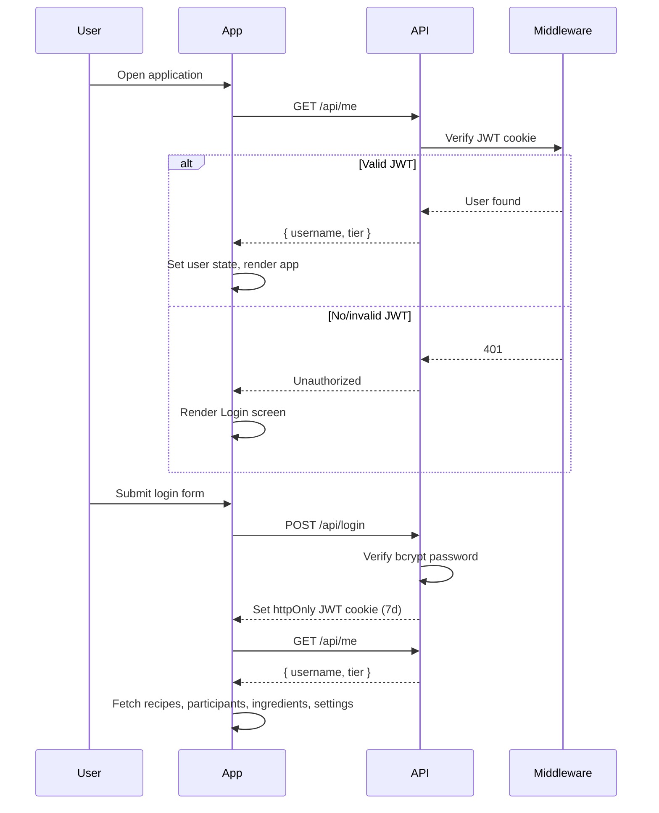
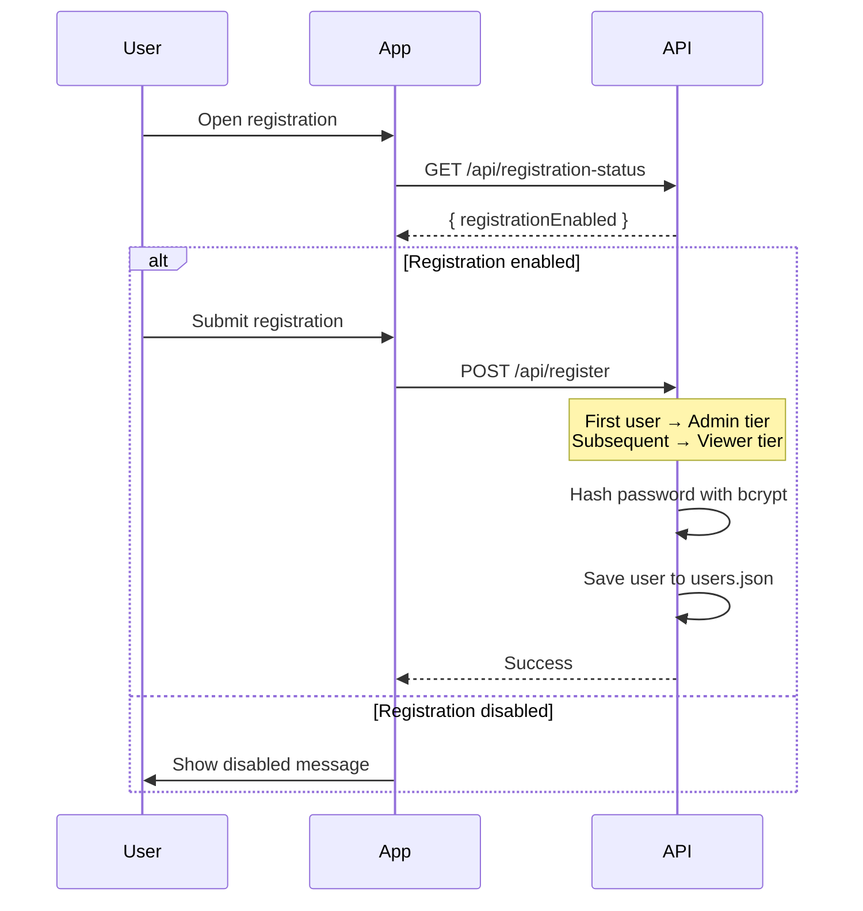
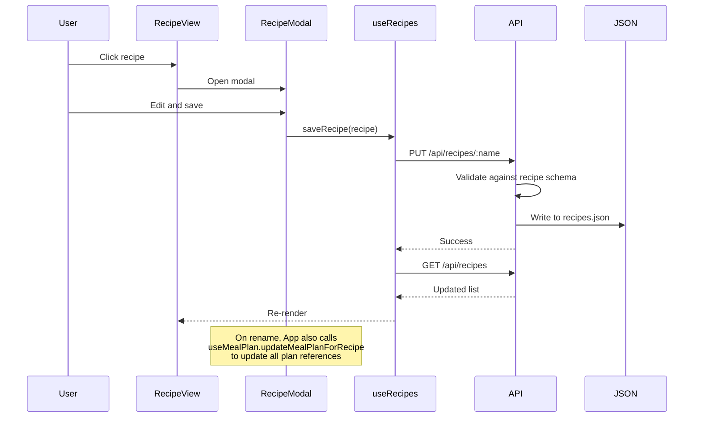
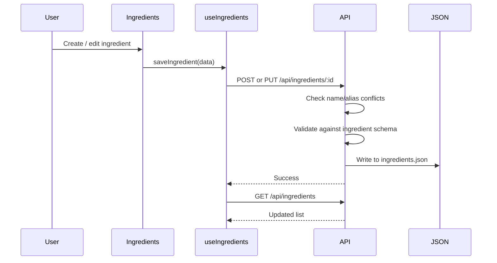
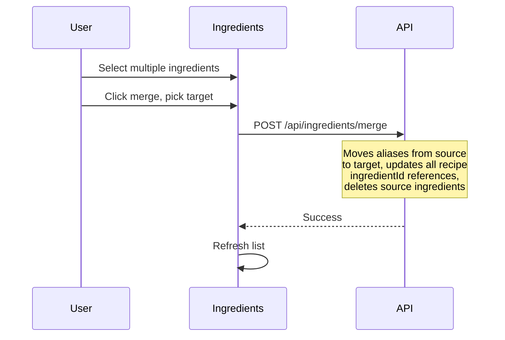
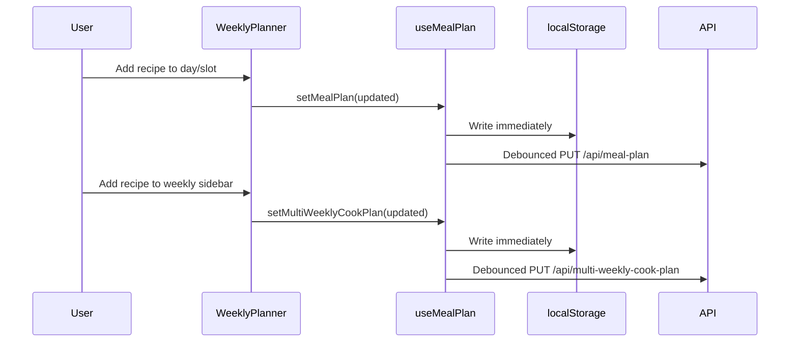
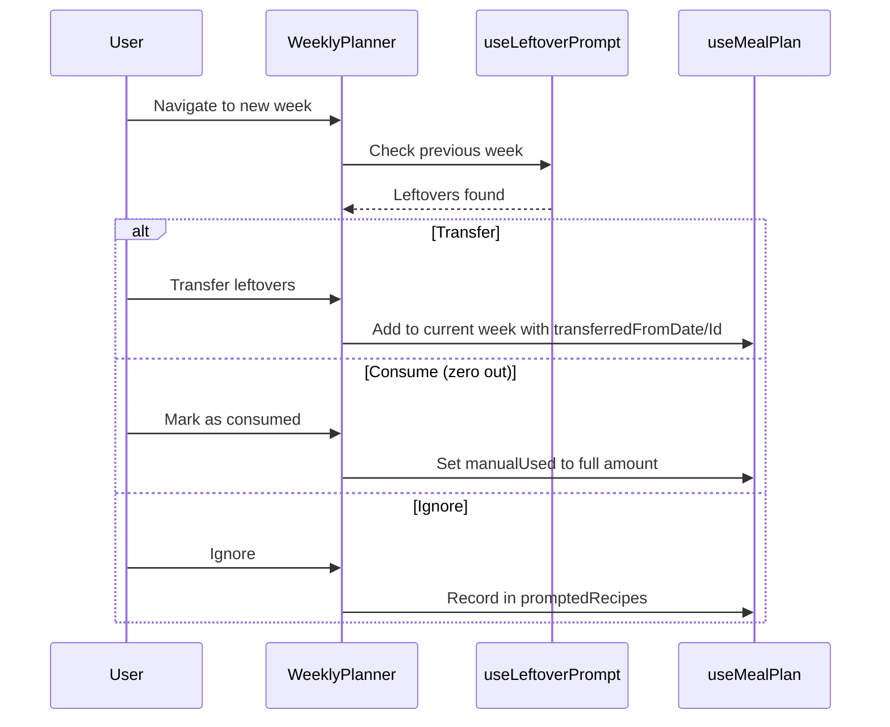
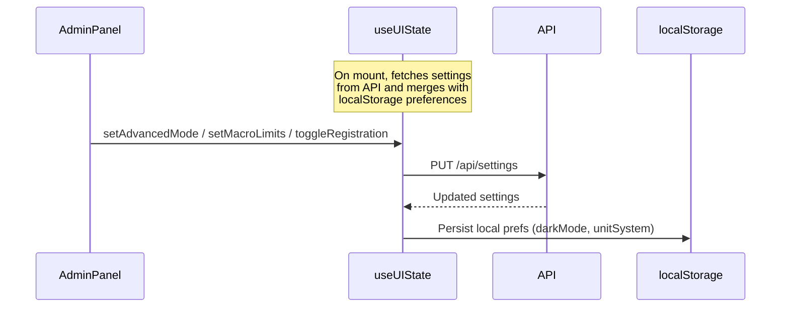
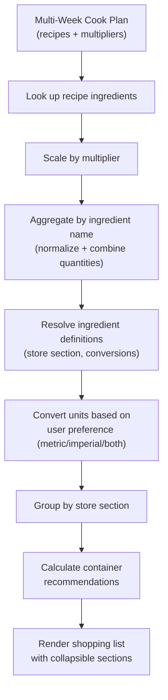

# Data Flow

Core data flows in the application: authentication, recipe management, ingredient management, meal planning, and
shopping list generation.

## Authentication Flow

## Registration Flow

## Recipe Management Flow

## Ingredient Management Flow

### Ingredient Merge Flow

## Meal Planning Flow

### Leftover Handling Flow

## Settings Sync Flow

## Shopping List Aggregation Flow

