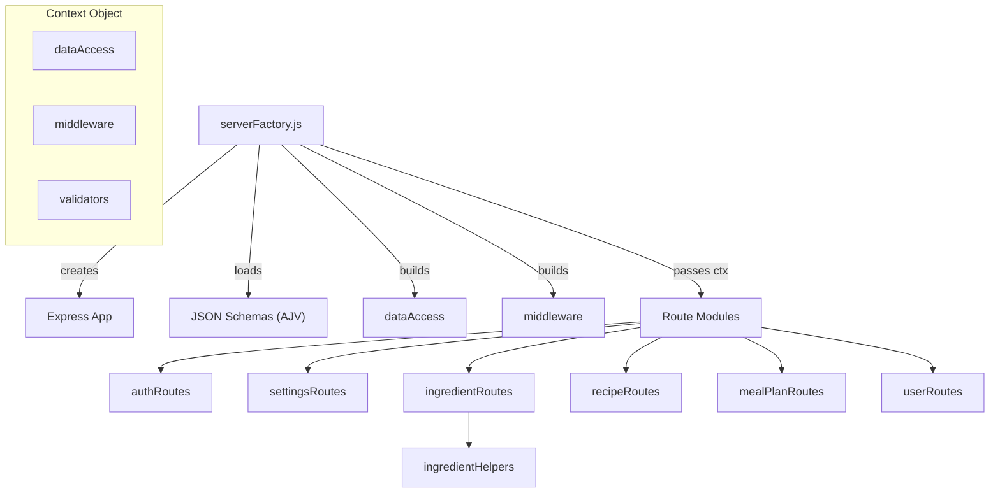

# Server Architecture

Express.js backend structure: the factory pattern, data access layer, middleware, and route modules.

## Overview

## serverFactory.js

The server factory creates and configures an Express application. It accepts an optional `dataDir` parameter, which
defaults to `process.env.DATA_DIR` or `../data`. This design enables test isolation -- each test suite can create its
own Express app with a temporary data directory.

### Initialization Steps

1. Load JSON schemas from `../schemas/` and compile AJV validators
2. Build the `dataAccess` module bound to the specified data directory
3. Build the `middleware` module with access to `dataAccess` and `JWT_SECRET`
4. Assemble the context object: `{ dataAccess, middleware, validators }`
5. Register global middleware: CORS, `cookie-parser`, `express.json()`, rate limiting
6. Register route modules (each receives the `ctx` object)
7. Set up error handler and static file serving (production)
8. Run `purgeInvalidUsers()` on startup

### Environment Variables

| Variable         | Purpose                                    | Default     |
|------------------|--------------------------------------------|-------------|
| `JWT_SECRET`     | Secret for signing JWT tokens              | (required in production) |
| `DATA_DIR`       | Path to JSON data files (Node only; in Docker the path is fixed at `/app/data`) | `../data`   |
| `PORT`           | Server listen port                         | `3001`      |
| `HOST`           | Server bind address (optional; defaults to `0.0.0.0`; not set in Docker) | `0.0.0.0`   |
| `SECURE_COOKIES` | Enable secure flag on cookies              | `false`     |
| `CORS_ORIGINS`   | Comma-separated allowed origins            | (unset)     |
| `DEPLOYED`       | Set in production; enables auth enforcement| (unset)     |

## dataAccess.js

The data access layer provides read/write functions for all JSON data files.

### Functions

| Function                | Purpose                                              |
|-------------------------|------------------------------------------------------|
| `readRecipes(options?)`  | Read recipes; optionally include invalid (`includeInvalid`, `'all'`) |
| `saveRecipes(recipes)`   | Validate, sort by name, write atomically             |
| `readIngredients()`      | Read ingredient definitions                          |
| `saveIngredients(list)`  | Sort by name, write atomically                       |
| `readUsers()`            | Read users, filter to valid tiers                    |
| `saveUsers(users)`       | Write atomically                                     |
| `readSettings()`         | Read settings, merge macroLimits with defaults       |
| `saveSettings(settings)` | Write atomically                                     |
| `readParticipants()`     | Read participant list                                |
| `saveParticipants(list)` | Write atomically                                     |
| `readMealPlan()`         | Read meal plan                                       |
| `saveMealPlan(plan)`     | Write atomically                                     |
| `readMultiWeeklyCookPlan()` | Read multi-week cook plan                         |
| `saveMultiWeeklyCookPlan(plan)` | Write atomically                               |
| `purgeInvalidUsers()`    | Remove users with invalid tiers on startup           |
| `validateOrFail(res, validator, data, label, req)` | Validate with AJV; 400 on failure (admin gets full errors) |

### Write Pattern

All write functions use a two-step atomic pattern:

1. `JSON.stringify()` the data
2. Write to `<path>.tmp`
3. Rename `<path>.tmp` to `<path>`

### Helper Constants

| Constant              | Value                                              |
|-----------------------|----------------------------------------------------|
| `MACRO_LIMITS_DEFAULTS` | Default min/max for protein, carbs, fat percentages |
| `toTitleCase(str)`    | Capitalize first letter of each word               |

## middleware.js

Authentication and authorization middleware.

| Export              | Type           | Purpose                                        |
|---------------------|----------------|-------------------------------------------------|
| `authenticate`      | Middleware     | Verify JWT, load user, set `req.user`           |
| `requireTier(tiers)` | Middleware factory | Check user tier against allowed list       |
| `requireEditor`     | Middleware     | `requireTier(['Editor', 'Admin'])`              |
| `requireAdmin`      | Middleware     | `requireTier(['Admin'])`                        |
| `safeDecodeURIComponent` | Helper   | Safe URL decode (returns original on error)     |

See [AUTH.md](AUTH.md) for detailed authentication flow documentation.

## Route Modules

Each route module exports a `register*Routes(app, ctx)` function that mounts endpoints on the Express app.

### authRoutes.js

Handles registration, login, logout, and session check.

| Method | Path                       | Auth       | Purpose                          |
|--------|----------------------------|------------|----------------------------------|
| GET    | `/api/registration-status` | None       | Check if registration is enabled |
| POST   | `/api/register`            | Rate limit | Register new user                |
| POST   | `/api/login`               | Rate limit | Login and set JWT cookie         |
| POST   | `/api/logout`              | None       | Clear JWT cookie                 |
| GET    | `/api/me`                  | authenticate | Return current user info       |

### settingsRoutes.js

Handles application settings.

| Method | Path                         | Auth                     | Purpose                    |
|--------|------------------------------|--------------------------|----------------------------|
| GET    | `/api/settings`              | authenticate             | Read all settings          |
| PUT    | `/api/settings`              | authenticate, requireAdmin | Update settings          |
| GET    | `/api/settings/registration` | authenticate             | Read registration status   |
| PUT    | `/api/settings/registration` | authenticate, requireAdmin | Toggle registration      |

### ingredientRoutes.js

Handles ingredient CRUD, alias management, and merge operations.

| Method | Path                                    | Auth                      | Purpose                        |
|--------|-----------------------------------------|---------------------------|--------------------------------|
| GET    | `/api/ingredients`                      | authenticate              | List all ingredients           |
| GET    | `/api/ingredients/:id`                  | authenticate              | Get single ingredient          |
| GET    | `/api/ingredients/:id/usage`            | authenticate              | Recipes using this ingredient  |
| GET    | `/api/ingredients/:id/alias-usage`      | authenticate              | Recipes using a specific alias |
| GET    | `/api/store-sections`                   | authenticate              | List unique store sections     |
| POST   | `/api/ingredients`                      | authenticate, requireEditor | Create ingredient            |
| PUT    | `/api/ingredients/:id`                  | authenticate, requireEditor | Update ingredient            |
| DELETE | `/api/ingredients/:id`                  | authenticate, requireEditor | Delete ingredient            |
| POST   | `/api/ingredients/merge`                | authenticate, requireEditor | Merge ingredients            |
| POST   | `/api/ingredients/:id/aliases/merge`    | authenticate, requireEditor | Merge two aliases            |
| PUT    | `/api/ingredients/:id/aliases/:aliasIndex`  | authenticate, requireEditor | Update alias             |
| DELETE | `/api/ingredients/:id/aliases/:aliasIndex`  | authenticate, requireEditor | Delete alias             |

### recipeRoutes.js

Handles recipe CRUD.

| Method | Path                 | Auth                       | Purpose                       |
|--------|----------------------|----------------------------|-------------------------------|
| GET    | `/api/recipes`       | authenticate               | List valid recipes            |
| GET    | `/api/recipes/all`   | authenticate, requireAdmin | List all recipes (inc. invalid)|
| POST   | `/api/recipes`       | authenticate, requireEditor | Create recipe               |
| PUT    | `/api/recipes/:name` | authenticate, requireEditor | Update recipe               |
| DELETE | `/api/recipes/:name` | authenticate, requireEditor | Delete recipe               |

### mealPlanRoutes.js

Handles participants, meal plan, and multi-week cook plan.

| Method | Path                          | Auth                      | Purpose                  |
|--------|-------------------------------|---------------------------|--------------------------|
| GET    | `/api/participants`           | authenticate              | List participants        |
| PUT    | `/api/participants`           | authenticate, requireEditor | Replace participants   |
| GET    | `/api/meal-plan`              | authenticate              | Get meal plan            |
| PUT    | `/api/meal-plan`              | authenticate, requireEditor | Save meal plan         |
| GET    | `/api/multi-weekly-cook-plan` | authenticate              | Get multi-week cook plan |
| PUT    | `/api/multi-weekly-cook-plan` | authenticate, requireEditor | Save multi-week cook plan |

### userRoutes.js

Handles user management (admin only).

| Method | Path                      | Auth                       | Purpose         |
|--------|---------------------------|----------------------------|-----------------|
| GET    | `/api/users`              | authenticate, requireAdmin | List users      |
| POST   | `/api/users`              | authenticate, requireAdmin | Create user     |
| PUT    | `/api/users/:username`    | authenticate, requireAdmin | Change tier     |
| DELETE | `/api/users/:username`    | authenticate, requireAdmin | Delete user     |

## ingredientHelpers.js

Shared business logic for ingredient operations, used by `ingredientRoutes.js`.

| Function                              | Purpose                                              |
|---------------------------------------|------------------------------------------------------|
| `findIngredientUsage(recipes, id)`    | Find all recipes referencing an ingredient by `ingredientId` |
| `checkIngredientNameConflict(ingredients, name, excludeId?)` | Check for duplicate names |
| `checkAliasConflict(ingredients, alias, excludeId?)` | Check if alias conflicts with any name or alias |
| `findAliasUsage(recipes, ingredientId, aliasName)` | Find recipes using a specific alias as display text |
| `updateRecipeIngredientDisplay(recipes, ingredientId, oldName, newName)` | Bulk update display text |
| `forEachRecipeIngredient(recipe, fn)`  | Iterate over all ingredients (flat and grouped)      |
| `someRecipeIngredient(recipe, fn)`     | Test any ingredient matches (flat and grouped)       |
