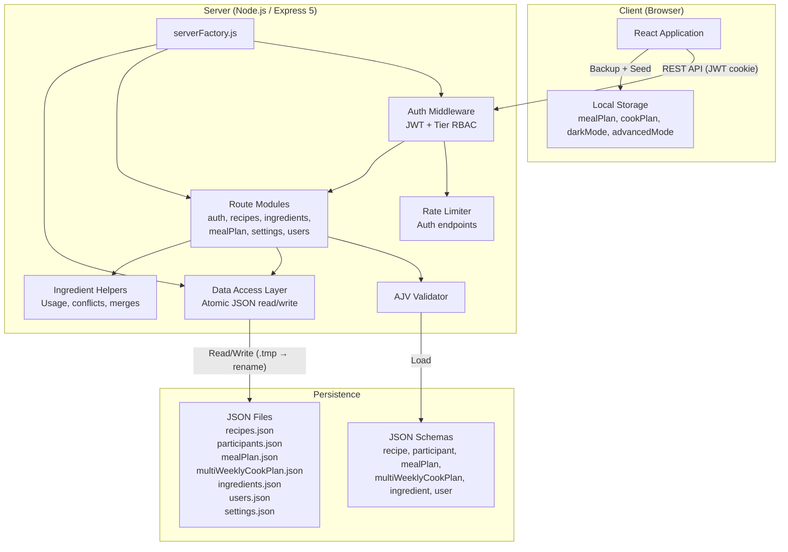
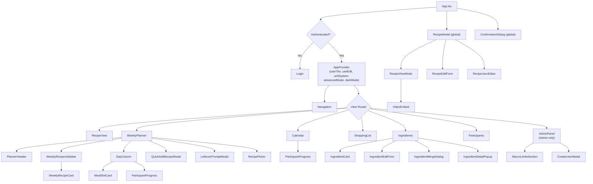
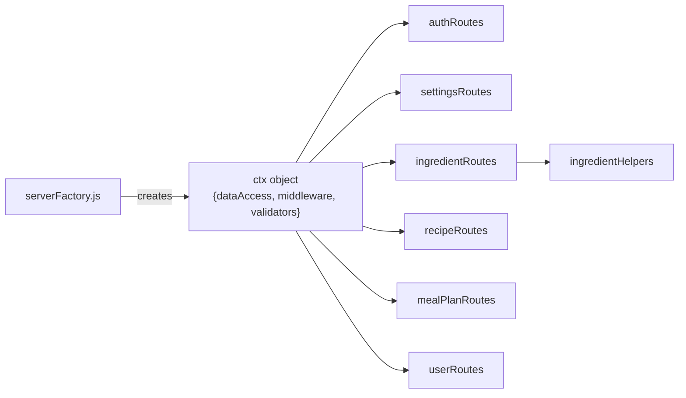

# System Architecture

High-level system diagram and application component hierarchy.

## System Diagram

```mermaid
graph TB
    subgraph client["Client (Browser)"]
        React[React Application]
        LS["Local Storage<br/>mealPlan, cookPlan, darkMode, advancedMode"]
    end

    subgraph server["Server (Node.js / Express 5)"]
        Factory[serverFactory.js]
        Auth[Auth Middleware<br/>JWT + Tier RBAC]
        RateLimit[Rate Limiter<br/>Auth endpoints]
        AJV[AJV Validator]
        Routes["Route Modules<br/>auth, recipes, ingredients,<br/>mealPlan, settings, users"]
        DataAccess["Data Access Layer<br/>Atomic JSON read/write"]
        Helpers["Ingredient Helpers<br/>Usage, conflicts, merges"]
    end

    subgraph persistence["Persistence"]
        JSON["JSON Files<br/>recipes.json<br/>participants.json<br/>mealPlan.json<br/>multiWeeklyCookPlan.json<br/>ingredients.json<br/>users.json<br/>settings.json"]
        Schemas["JSON Schemas<br/>recipe, participant, mealPlan,<br/>multiWeeklyCookPlan, ingredient, user"]
    end

    React -->|"REST API (JWT cookie)"| Auth
    Auth --> RateLimit
    Auth --> Routes
    Routes --> AJV
    AJV -->|Load| Schemas
    Routes --> DataAccess
    Routes --> Helpers
    DataAccess -->|"Read/Write (.tmp → rename)"| JSON
    React -->|"Backup + Seed"| LS
    Factory --> Auth
    Factory --> Routes
    Factory --> DataAccess
```

## Component Hierarchy

```mermaid
graph TD
    App["App.tsx"] --> AuthCheck{"Authenticated?"}
    AuthCheck -->|No| Login[Login]
    AuthCheck -->|Yes| AppProvider["AppProvider<br/>(userTier, canEdit, unitSystem,<br/>advancedMode, darkMode)"]

    AppProvider --> Nav[Navigation]
    AppProvider --> ViewRouter{View Router}

    ViewRouter --> RV[RecipeView]
    ViewRouter --> Cal[Calendar]
    ViewRouter --> WP[WeeklyPlanner]
    ViewRouter --> SL[ShoppingList]
    ViewRouter --> Ing[Ingredients]
    ViewRouter --> Part[Participants]
    ViewRouter --> Admin["AdminPanel<br/>(Admin only)"]

    App --> RM["RecipeModal (global)"]
    App --> CD["ConfirmationDialog (global)"]

    RM --> RMView[RecipeViewMode]
    RM --> RMEdit[RecipeEditForm]
    RM --> RMJson[RecipeJsonEditor]
    RMView --> VideoEmbed[VideoEmbed]

    WP --> PH[PlannerHeader]
    WP --> Sidebar[WeeklyRecipesSidebar]
    WP --> DC[DayColumn]
    WP --> QAM[QuickAddRecipeModal]
    WP --> LPM[LeftoverPromptModal]
    WP --> RP[RecipePicker]
    DC --> MSC[MealSlotCard]
    DC --> PP1[ParticipantProgress]
    Sidebar --> WRC[WeeklyRecipeCard]

    Cal --> PP2[ParticipantProgress]

    Ing --> IngCard[IngredientCard]
    Ing --> IngEdit[IngredientEditForm]
    Ing --> IngMerge[IngredientMergeDialog]
    Ing --> IngDetail[IngredientDetailPopup]

    Admin --> MacroLimits[MacroLimitsSection]
    Admin --> CreateUser[CreateUserModal]
```

## Server Module Architecture

```mermaid
graph LR
    SF[serverFactory.js] -->|creates| Ctx["ctx object<br/>{dataAccess, middleware, validators}"]
    Ctx --> AR[authRoutes]
    Ctx --> SR[settingsRoutes]
    Ctx --> IR[ingredientRoutes]
    Ctx --> RR[recipeRoutes]
    Ctx --> MPR[mealPlanRoutes]
    Ctx --> UR[userRoutes]
    IR --> IH[ingredientHelpers]
```
