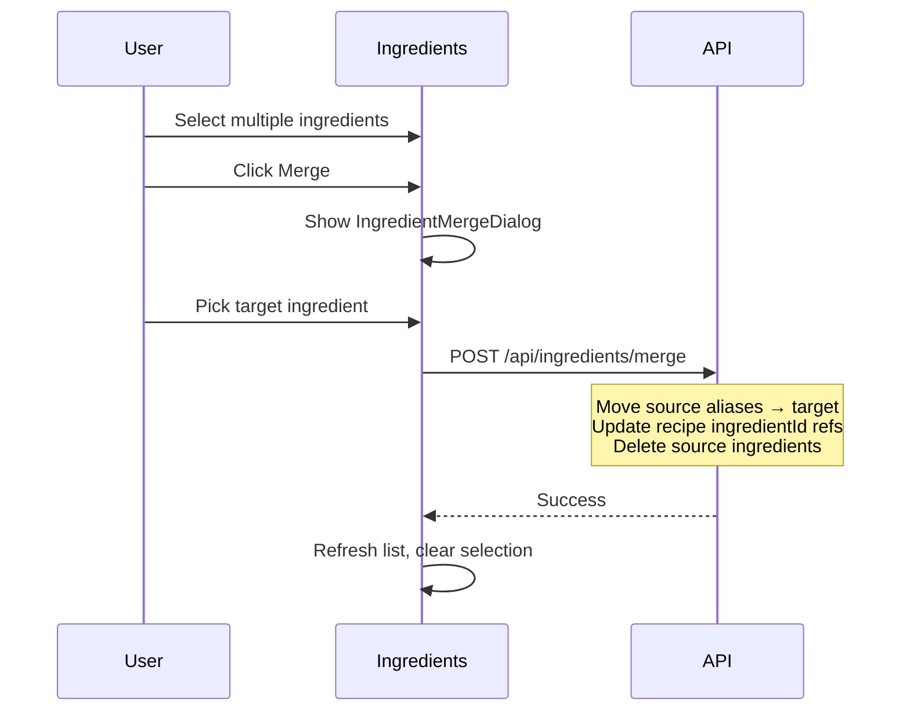

# Ingredient Management

Centralized ingredient definitions with aliases, store sections, container sizes, and unit conversions.

## Ingredients (`src/components/Ingredients.tsx`)

Full CRUD view for managing ingredient definitions.

### Props

| Prop              | Type                     | Description                              |
|-------------------|--------------------------|------------------------------------------|
| `ingredients`     | `IngredientDefinition[]` | All ingredient definitions               |
| `storeSections`   | `string[]`               | Available store sections                 |
| `onSave`          | `function`               | Save ingredient handler                  |
| `onDelete`        | `function`               | Delete ingredient handler                |
| `onCheckUsage`    | `function`               | Check which recipes use an ingredient    |
| `onMerge`         | `function`               | Merge ingredients handler                |
| `onRecipeClick`   | `function`               | Open recipe from usage results           |
| `onCheckAliasUsage` | `function`             | Check which recipes use a specific alias |
| `onUpdateAlias`   | `function`               | Update alias handler                     |
| `onDeleteAlias`   | `function`               | Delete alias handler                     |
| `onMergeAlias`    | `function`               | Merge aliases handler                    |

### Subcomponents

| Component               | Purpose                                                    |
|-------------------------|------------------------------------------------------------|
| `IngredientsToolbar`    | Search bar, section filter, add button                     |
| `IngredientCard`        | Display card for a single ingredient with aliases          |
| `IngredientEditForm`    | Edit form for name, store section, aliases, containers, conversions |
| `IngredientMergeDialog` | Select target ingredient when merging multiple ingredients  |
| `AliasDeleteDialog`     | Confirm alias deletion with replacement options            |
| `AliasMergeDialog`      | Merge one alias into another or the canonical name         |
| `IngredientDetailPopup` | Popup showing ingredient details and recipe usage          |
| `SelectionActionBar`    | Floating toolbar for bulk actions on selected ingredients  |

### Features

- Search by ingredient name or alias
- Filter by store section
- Add new ingredients with name, store section, aliases
- Edit ingredients inline
- Delete ingredients (blocked if used in recipes)
- Bulk selection with shift-click support
- Merge multiple ingredients into a target (consolidates aliases, updates recipe `ingredientId` references)
- Store section management (create new sections, reassign)

### Alias Management

Uses the `useAliasManagement` hook for alias editing, deletion, and merge workflows:

- **Add alias**: Add new alias names to an ingredient
- **Edit alias**: Rename an existing alias, optionally updating recipe display text
- **Delete alias**: Remove an alias with options to replace with canonical name or another alias in affected recipes
- **Merge aliases**: Merge one alias into another alias or the canonical name

Each alias operation checks recipe usage first via `GET /api/ingredients/:id/alias-usage?alias=<name>` to show the
user what recipes will be affected.

### Ingredient Data Model

```
IngredientDefinition {
  id: string (UUID)
  name: string
  storeSection: string (default: "Unassigned")
  aliases?: string[]
  containerSizes?: { quantity: number, unit: string, label?: string }[]
  conversions?: {
    weightToVolume?: { gramsPerMl: number }
    portionToVolume?: { portionSize: number, unit: string }
  }
}
```

### Merge Flow



### Recipe Linking

Each recipe ingredient can reference an `IngredientDefinition` via the `ingredientId` field (UUID). This link is used
for:

- Store section grouping in the shopping list
- Unit conversion using ingredient-specific conversion ratios
- Container size recommendations
- Alias resolution (display name vs canonical name)

The admin panel's Recipe Data Audit can identify recipes with unlinked ingredients that need to be connected
to ingredient definitions.
