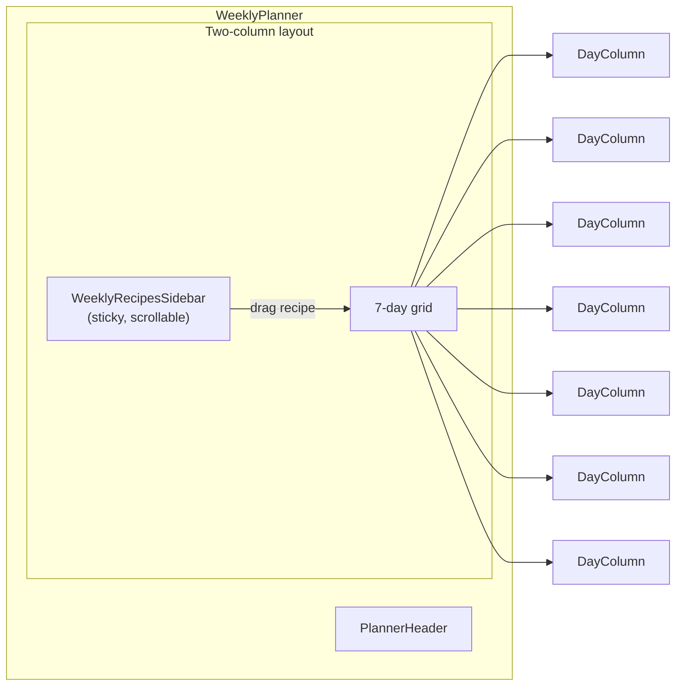
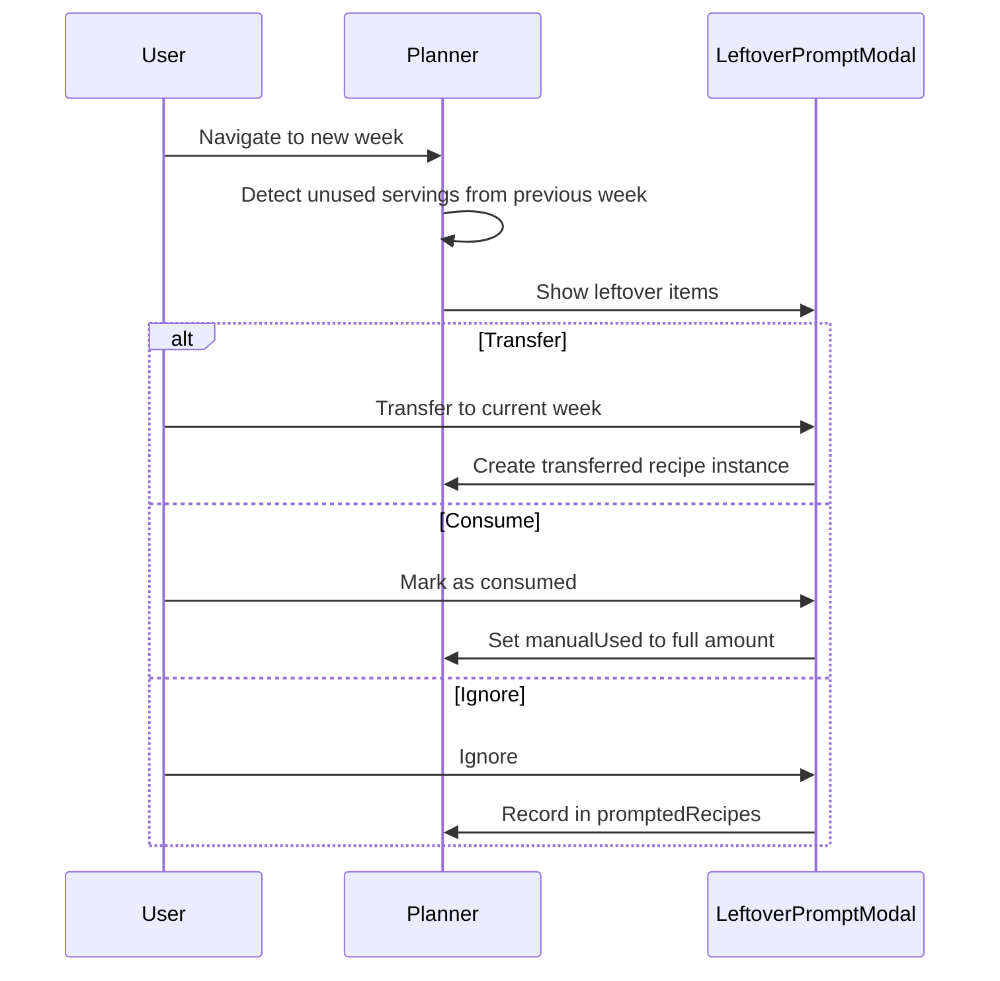
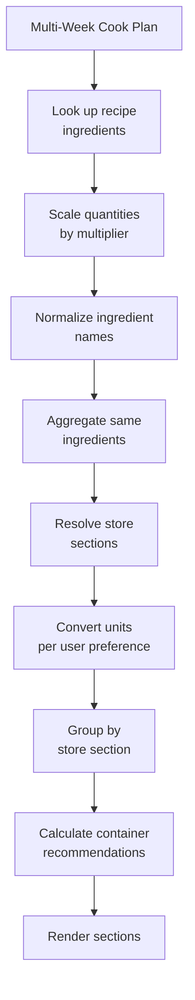

# Planning Views

Calendar, WeeklyPlanner (with subcomponents), and ShoppingList.

## Calendar (`src/components/Calendar.tsx`)

Monthly calendar view of the meal plan.

### Props

| Prop                     | Type            | Description           |
|--------------------------|-----------------|-----------------------|
| `currentMonth`           | `Date`          | Displayed month       |
| `setCurrentMonth`        | `function`      | Month change handler  |
| `selectedDate`           | `Date`          | Selected day          |
| `setSelectedDate`        | `function`      | Day selection handler |
| `mealPlan`               | `MealPlan`      | Meal plan data        |
| `setMealPlan`            | `function`      | Update meal plan      |
| `setMultiWeeklyCookPlan` | `function`      | Update cook plan      |
| `recipes`                | `Recipe[]`      | Available recipes     |
| `setSelectedRecipe`      | `function`      | Open recipe modal     |
| `participants`           | `Participant[]` | For progress display  |

### Features

- Month navigation with today button
- Day selection
- Meal display by type (breakfast, lunch, dinner, snacks, drinks)
- Daily nutritional totals
- Participant progress bars (`ParticipantProgress`)
- Participant filter dropdown
- Drag and drop meal moving between days/slots
- Clear plan functionality
- `DaySidebarMeals` for selected day detail

---

## WeeklyPlanner (`src/components/WeeklyPlanner.tsx`)

Weekly meal planning with batch cooking, leftover tracking, and drag-and-drop.

### Props

| Prop                     | Type            | Description            |
|--------------------------|-----------------|------------------------|
| `recipes`                | `Recipe[]`      | Available recipes      |
| `mealPlan`               | `MealPlan`      | Meal plan data         |
| `setMealPlan`            | `function`      | Update meal plan       |
| `multiWeeklyCookPlan`    | `object`        | Multi-week cook plan   |
| `setMultiWeeklyCookPlan` | `function`      | Update cook plan       |
| `promptedRecipes`        | `object`        | Leftover prompt state  |
| `setPromptedRecipes`     | `function`      | Update prompt state    |
| `selectedDate`           | `Date`          | Current week reference |
| `setSelectedDate`        | `function`      | Week navigation        |
| `setSelectedRecipe`      | `function`      | Open recipe modal      |
| `participants`           | `Participant[]` | For progress tracking  |

### Subcomponents

| Component                | File                          | Purpose                                       |
|--------------------------|-------------------------------|-----------------------------------------------|
| `PlannerHeader`          | `WeeklyPlanner/PlannerHeader.tsx` | Week navigation, participant selector, macros toggle |
| `WeeklyRecipesSidebar`   | `WeeklyPlanner/WeeklyRecipesSidebar.tsx` | Sticky sidebar with weekly recipe cards |
| `WeeklyRecipeCard`       | `WeeklyPlanner/WeeklyRecipeCard.tsx` | Single recipe card with multiplier input |
| `DayColumn`              | `WeeklyPlanner/DayColumn.tsx` | One day column with meal slots                |
| `MealSlotCard`           | `WeeklyPlanner/MealSlotCard.tsx` | Single meal entry (servings +/-, remove, drag) |
| `QuickAddRecipeModal`    | `WeeklyPlanner/QuickAddRecipeModal.tsx` | Quick add recipe to a specific slot |
| `LeftoverPromptModal`    | `WeeklyPlanner/LeftoverPromptModal.tsx` | Leftover transfer/consume/ignore dialog |
| `RecipePicker`           | `RecipePicker.tsx`            | Full recipe selection modal                   |
| `ParticipantProgress`    | `ParticipantProgress.tsx`     | Macro progress bars per participant           |

### Hooks

| Hook                      | Purpose                                           |
|---------------------------|---------------------------------------------------|
| `usePlannerWeek`          | Compute week boundaries (`weekStart`, `weekEnd`, `weekDays`) |
| `usePlannerConfirmation`  | Planner-scoped confirmation dialog state          |
| `useWeeklyRecipeCards`    | Compute sidebar recipe card data from cook plan   |
| `useSlotMinHeights`       | Track minimum heights for aligned meal slots      |
| `useLeftoverPrompt`       | Detect and manage leftovers from previous weeks   |
| `useWeeklyPlanActions`    | Add/remove recipes, update multipliers, clear week|
| `usePlannerDragDrop`      | Drag-and-drop handlers and quick-add slot state   |

### Layout

### Features

- Weekly recipes sidebar with batch cooking multipliers and progress tracking
- 7-day grid with meal slot types: breakfast, lunch, dinner, snacks, drinks
- Drag and drop between sidebar and slots, and between slots
- Quick-add recipe to a slot via `QuickAddRecipeModal` (search, favorites, per-participant)
- Participant assignment per meal
- Serving count increment/decrement
- Leftover detection and prompts (transfer, consume, ignore)
- Batch cooking tracking including transferred servings across weeks
- Nutritional progress per participant with macro toggle
- Clear week functionality with confirmation

### QuickAddRecipeModal

Lightweight recipe selector for adding to a specific meal slot:

- Search by recipe name
- Favorites filter
- Shows which recipes are already in the plan
- Per-participant meal assignment
- Single-click to add

### Leftover Flow

---

## ShoppingList (`src/components/ShoppingList.tsx`)

Aggregates ingredients from the weekly cook plan into a shopping list.

### Props

| Prop                  | Type                    | Description                    |
|-----------------------|-------------------------|--------------------------------|
| `mealPlan`            | `MealPlan`              | For reference                  |
| `recipes`             | `Recipe[]`              | Recipe lookup                  |
| `participants`        | `Participant[]`         | For display                    |
| `multiWeeklyCookPlan` | `object`                | Cook plan data (source of truth)|
| `selectedDate`        | `Date`                  | Current week                   |
| `setSelectedDate`     | `function`              | Week navigation                |
| `setSelectedRecipe`   | `function`              | Open recipe modal              |
| `ingredients`         | `IngredientDefinition[]`| Ingredient definitions for store sections and conversions |

### Features

- Week navigation
- Ingredient aggregation from the multi-week cook plan (honors multipliers and transferred leftovers)
- Grouping by store section (resolved from `IngredientDefinition.storeSection`)
- Collapsible section headers
- Unit conversion (metric / imperial / both) using ingredient-specific conversion data
- Container size recommendations (how many containers of each size are needed)
- Smart quantity combining (e.g., 1 lb + 8 oz = 1 lb 8 oz)
- Copy to clipboard (formatted text)
- Recipe source linking (click to open recipe modal with highlighted ingredients)

### Aggregation Flow

