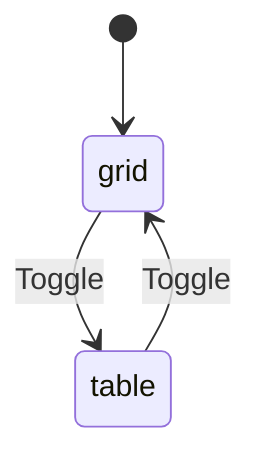
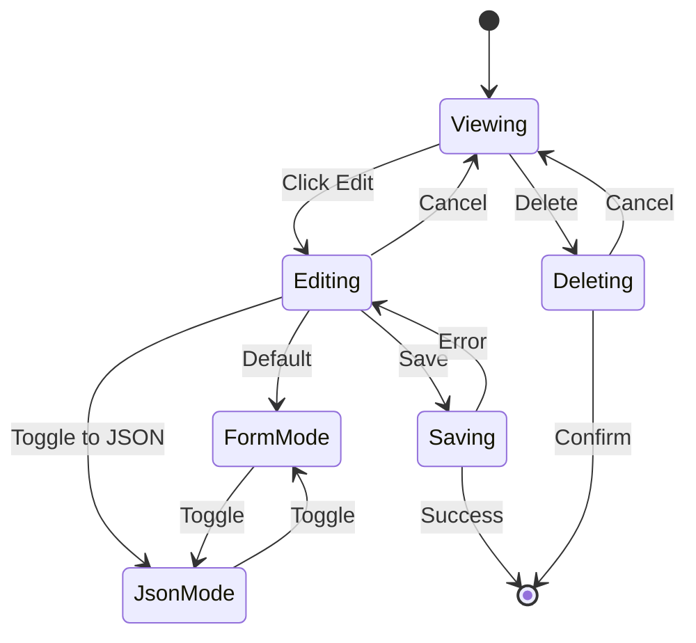

# Recipe Management

Recipe listing, filtering, the recipe view/edit modal, and the recipe picker for adding to plans.

## RecipeView (`src/components/RecipeView.tsx`)

Displays the recipe library with search, filter, and sort capabilities.

### Props

| Prop                       | Type                              | Description                |
|----------------------------|-----------------------------------|----------------------------|
| `recipes`                  | `Recipe[]`                        | All recipes                |
| `sortedAndFilteredRecipes` | `Recipe[]`                        | Filtered/sorted recipes    |
| `viewMode`                 | `'grid' \| 'table'`              | Display mode               |
| `setViewMode`              | `function`                        | Change display mode        |
| `searchQuery`              | `string`                          | Search term                |
| `setSearchQuery`           | `function`                        | Update search              |
| `allTags`                  | `string[]`                        | Available tags             |
| `selectedTags`             | `string[]`                        | Active tag filters         |
| `toggleTag`                | `function`                        | Toggle tag filter          |
| `allCategories`            | `string[]`                        | Available categories       |
| `selectedCategories`       | `string[]`                        | Active category filters    |
| `toggleCategory`           | `function`                        | Toggle category filter     |
| `clearFilters`             | `function`                        | Reset all filters          |
| `sortConfig`               | `object`                          | Current sort settings      |
| `handleSort`               | `function`                        | Change sort                |
| `selectedRatings`          | `('up' \| 'down' \| 'neutral')[]`| Active rating filters      |
| `toggleRating`             | `function`                        | Toggle rating filter       |
| `showOnlyFavorites`        | `boolean`                         | Favorites filter           |
| `setShowOnlyFavorites`     | `function`                        | Set favorites filter       |
| `showOnlyNeverCooked`      | `boolean`                         | Never cooked filter        |
| `setShowOnlyNeverCooked`   | `function`                        | Set never cooked filter    |
| `setSelectedRecipe`        | `function`                        | Open recipe modal          |
| `onDeleteRecipes`          | `function`                        | Bulk delete handler        |
| `mealPlan`                 | `MealPlan`                        | For cook history           |
| `multiWeeklyCookPlan`      | `MultiWeeklyCookPlan`             | For cook history           |

### Features

- Grid view with recipe cards
- Table view with sortable columns
- Search by name, category, tag, ingredient
- Multi-select category and tag filtering
- Rating filtering (thumbs up / down / neutral)
- Favorites filtering
- Never cooked filtering
- Cooking frequency tracking display
- Multi-select for bulk deletion
- Invalid recipe warning (admin view)

### View Modes

---

## RecipeModal (`src/components/RecipeModal/`)

Full-featured modal for viewing and editing recipes. Split into a directory with focused subcomponents.

### File Structure

| File                   | Purpose                                        |
|------------------------|------------------------------------------------|
| `index.tsx`            | Modal shell, header, view/edit mode switching  |
| `RecipeViewMode.tsx`   | Read-only recipe display                       |
| `RecipeEditForm.tsx`   | Full edit form with ingredient autocomplete    |
| `RecipeJsonEditor.tsx` | Raw JSON editor for advanced mode              |

### Props (index.tsx)

| Prop                     | Type                    | Description                     |
|--------------------------|-------------------------|---------------------------------|
| `recipe`                 | `Recipe`                | Recipe to display/edit          |
| `onClose`                | `function`              | Close handler                   |
| `onSave`                 | `function`              | Save handler                    |
| `onDelete`               | `function`              | Delete handler                  |
| `mealPlan`               | `MealPlan`              | For cook history display        |
| `multiWeeklyCookPlan`    | `MultiWeeklyCookPlan`   | For cook history display        |
| `highlightedIngredients` | `string[]`              | Ingredients to highlight        |
| `ingredientDefinitions`  | `IngredientDefinition[]`| For ingredient autocomplete     |

### Edit Modes

The modal supports two edit modes, toggled by a switch in the header:

- **Form mode** (`RecipeEditForm`): Structured form with fields for name, categories, prep/cook time, servings, macros,
  tags, ingredients (with autocomplete from `ingredientDefinitions`), and instructions. Supports grouped
  ingredients/instructions.
- **JSON mode** (`RecipeJsonEditor`): Raw JSON text editor for advanced users. Only available when `advancedMode` is
  enabled in settings.

### State Flow

### RecipeViewMode Features

- Formatted ingredient display with unit conversion (metric / imperial / both)
- Ingredient highlighting (from shopping list cross-reference)
- Grouped or flat ingredient/instruction display
- Video player support via `VideoEmbed` (YouTube, Vimeo, direct URLs)
- Macro nutrient display
- Total cook count tracking
- Favorite toggle and rating display
- MFP ID display

### RecipeEditForm Features

- Name, categories (multi-select), prep/cook time, servings
- Macro input (calories, protein, carbs, fat)
- Tag management with autocomplete from existing tags
- Ingredient editing with autocomplete from `ingredientDefinitions`
- Grouped ingredients/instructions support (add/remove/reorder groups)
- Metric and imperial measurement fields per ingredient

---

## RecipePicker (`src/components/RecipePicker.tsx`)

Modal for selecting recipes to add to the weekly meal plan.

### Props

| Prop                  | Type            | Description                |
|-----------------------|-----------------|----------------------------|
| `recipes`             | `Recipe[]`      | Available recipes          |
| `onSelect`            | `function`      | Selection handler          |
| `onClose`             | `function`      | Close handler              |
| `multiWeeklyCookPlan` | `object`        | Current week's plan        |
| `participants`        | `Participant[]` | For nutrition suggestions  |
| `weekStartStr`        | `string`        | Week identifier            |
| `allTags`             | `string[]`      | Available tags             |
| `mealPlan`            | `MealPlan`      | For usage tracking         |

### Features

- Two tabs: Search and Suggestions
- Category and tag filtering
- Recipe search by name
- Multiplier selection per recipe
- Batch add multiple recipes
- Quick add with single click
- Suggestions based on shared ingredients with current week and gaps in participant nutrition

---

## VideoEmbed (`src/components/VideoEmbed.tsx`)

Renders embedded video players for recipe video links.

### Props

| Prop | Type     | Description        |
|------|----------|--------------------|
| `url`| `string` | Video URL to embed |

### Supported Formats

| URL Pattern            | Player         |
|------------------------|----------------|
| `youtube.com/watch?v=` | YouTube iframe |
| `youtu.be/`            | YouTube iframe |
| `vimeo.com/`           | Vimeo iframe   |
| Other                  | HTML5 `<video>` |
