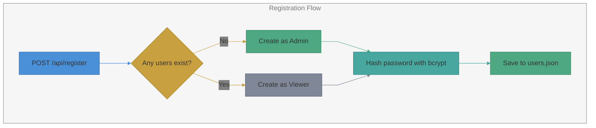
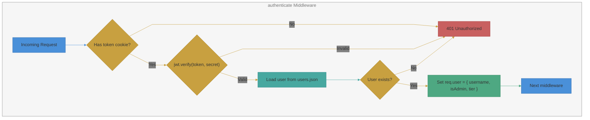

# Authentication & Authorization

JWT-based authentication with role-based access control (RBAC) using three user tiers.

## User Tiers

| Tier     | Capabilities                                                     |
|----------|------------------------------------------------------------------|
| Viewer   | Read all data (recipes, ingredients, meal plans, participants)   |
| Editor   | Read + write recipes, ingredients, meal plans, participants      |
| Admin    | Full access including user management, settings, and invalid recipe access |

## Registration

Handled by `POST /api/register` in `authRoutes.js`.

- The first user to register automatically becomes an **Admin**
- Subsequent users are assigned the **Viewer** tier
- Registration can be disabled by an Admin via `PUT /api/settings/registration`
- When registration is disabled, only Admins can create new accounts through the Admin Panel

## Login

Handled by `POST /api/login` in `authRoutes.js`.

1. Look up user by username in `users.json`
2. Verify password with `bcrypt.compare()`
3. Sign a JWT containing `{ username }` with `JWT_SECRET` (7-day expiry)
4. Set the JWT as an httpOnly cookie (`token`)

Cookie options:
- `httpOnly: true` (not accessible via JavaScript)
- `sameSite: 'strict'`
- `secure`: set when `SECURE_COOKIES=true` (for HTTPS deployments)
- `maxAge`: 7 days

## Session Check

On app mount, the frontend calls `GET /api/me`:

- If a valid JWT cookie is present, returns `{ username, tier }`
- If no/invalid JWT, returns 401 and the app shows the Login screen

## Logout

`POST /api/logout` clears the `token` cookie.

## Middleware

Defined in `server/middleware.js`:

| Middleware              | Purpose                                                |
|-------------------------|--------------------------------------------------------|
| `authenticate`          | Verify JWT from `req.cookies.token`, load user, set `req.user` |
| `requireTier(tiers[])`  | Check that `req.user.tier` is in the allowed tiers list |
| `requireEditor`         | Shorthand for `requireTier(['Editor', 'Admin'])`       |
| `requireAdmin`          | Shorthand for `requireTier(['Admin'])`                 |

### authenticate Middleware

### Test Mode Bypass

When `DEPLOYED` env var is not set (i.e., in development/test), the `authenticate` middleware bypasses JWT verification
and sets `req.user` to a `testuser` Admin. This allows tests and development to proceed without authentication.

## Rate Limiting

Auth endpoints (`/api/register`, `/api/login`) are protected by `express-rate-limit`:

- Window: 15 minutes
- Max requests: 20 per window
- Skipped in test environment (`NODE_ENV === 'test'`)

## User Management

Admin users can manage accounts via the Admin Panel:

| Action      | Endpoint                      | Rules                              |
|-------------|-------------------------------|------------------------------------|
| List users  | `GET /api/users`              | Passwords excluded from response   |
| Create user | `POST /api/users`             | Admin sets username, password, tier|
| Change tier | `PUT /api/users/:username`    | Cannot demote the only Admin       |
| Delete user | `DELETE /api/users/:username`  | Cannot delete self or only Admin  |

## Startup Cleanup

`purgeInvalidUsers()` runs on server startup to remove any user records with invalid tiers or missing required fields.
