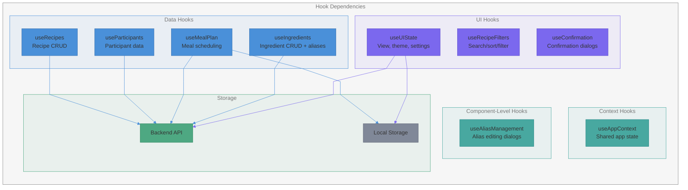
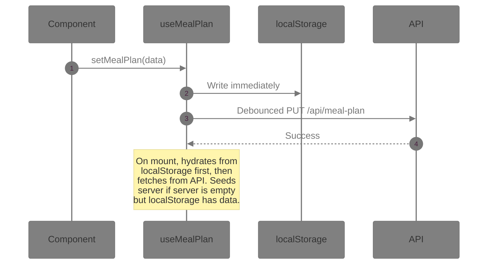

# Hooks Architecture

Custom hooks used by the application, their responsibilities, persistence model, and key methods.

## Hook Dependency Diagram

## App-Level Hooks

| Hook               | Responsibility                                | Persistence        | Key Methods                                                                                      |
|---------------------|-----------------------------------------------|--------------------|-------------------------------------------------------------------------------------------------|
| `useRecipes`       | Recipe CRUD                                    | API                | `fetchRecipes`, `saveRecipe`, `deleteRecipe`                                                    |
| `useParticipants`  | Participant management                         | API                | `fetchParticipants`, `saveParticipants`                                                         |
| `useMealPlan`      | Meal scheduling, batch cooking, leftover sync  | API + localStorage | `setMealPlan`, `setMultiWeeklyCookPlan`, `updateMealPlanForRecipe`, `promptedRecipes`           |
| `useIngredients`   | Ingredient CRUD, merging, alias ops            | API                | `fetchIngredients`, `saveIngredient`, `deleteIngredient`, `mergeIngredients`, `checkUsage`, `checkAliasUsage`, `updateAlias`, `deleteAlias`, `mergeAlias` |
| `useUIState`       | View, theme, units, settings sync              | API + localStorage | `setView`, `setDarkMode`, `setUnitSystem`, `setAdvancedMode`, `fetchSettings`, `toggleRegistration`, `setMacroLimits` |
| `useRecipeFilters` | Search, filter, sort recipes                   | In-memory          | `toggleTag`, `toggleCategory`, `toggleRating`, `handleSort`, `clearFilters`, `setShowOnlyFavorites`, `setShowOnlyNeverCooked` |
| `useConfirmation`  | Confirmation dialog state                      | In-memory          | `show`, `dismiss`, `handleCancel`                                                               |

## Context Hook

| Hook             | Responsibility                        | Source            |
|------------------|---------------------------------------|-------------------|
| `useAppContext`  | Access shared app state from `AppContext` | `React.useContext` |

`AppContext` provides: `userTier`, `canEdit`, `unitSystem`, `advancedMode`, `darkMode`.

## Component-Level Hooks

| Hook                  | Used By       | Responsibility                          | Key Methods                                                                     |
|-----------------------|---------------|-----------------------------------------|---------------------------------------------------------------------------------|
| `useAliasManagement`  | Ingredients   | Alias editing, deletion, and merge UI   | `startEditAlias`, `saveEditAlias`, `handleDeleteAliasClick`, `confirmAliasDeleteWithReplacement`, `openAliasMerge`, `confirmAliasMerge` |

## WeeklyPlanner Hooks

These hooks decompose the WeeklyPlanner logic into focused concerns:

| Hook                      | Responsibility                                    | Key Returns                                              |
|---------------------------|---------------------------------------------------|----------------------------------------------------------|
| `usePlannerWeek`          | Compute week boundaries and day list              | `weekStart`, `weekEnd`, `weekDays`, `weekStartStr`       |
| `usePlannerConfirmation`  | Confirmation dialog state for planner actions      | Planner-scoped confirmation state                        |
| `useWeeklyRecipeCards`    | Compute recipe card data for the sidebar           | `WeeklyRecipeCardData[]`                                 |
| `useSlotMinHeights`       | Track min heights for meal slots across days       | Slot height map, `plannerContainerRef`                   |
| `useLeftoverPrompt`       | Detect leftovers from previous week                | `leftovers`, `onTransfer`, `onZeroOut`, `onIgnore`       |
| `useWeeklyPlanActions`    | Add/remove recipes, update multipliers, clear week | `addRecipe`, `removeRecipe`, `updateMultiplier`, `clear` |
| `usePlannerDragDrop`      | Drag-and-drop handlers and quick-add state         | `onDragStart`, `onDragOver`, `onDrop`, `quickAddSlot`    |

## useMealPlan Sync Model

