# Design System

Centralized design tokens and style layers used by the project.

## Token Architecture

```mermaid
---
config:
  theme: base
  flowchart:
    curve: linear
  themeVariables:
    lineColor: "#c8a0b0"
    primaryBorderColor: "#c8a0b0"
    edgeLabelBackground: "#808080"
    textColor: "#777777"
    titleColor: "#777777"
---
flowchart LR
    subgraph TokenArchitecture["Token Architecture"]
        subgraph DesignTokens["Design Tokens - designTokens.ts"]
            Colors["colors<br/>Primary, Status"]:::blue
            MealTypes["mealTypeStyles<br/>Breakfast, Lunch, etc."]:::amber
            Buttons["buttonStyles<br/>Primary, Secondary, Danger"]:::purple
            Cards["cardStyles<br/>Base, Padded, Interactive"]:::teal
            Typography["typographyStyles<br/>Headings, Labels"]:::slate
            Status["statusStyles<br/>Success, Warning, Error"]:::rose
            Macros["macroColors<br/>Calories, Protein, etc."]:::green
        end

        subgraph CSSLayer["CSS Layer - index.css"]
            BaseLayer["@layer base<br/>app-shell, page-shell"]:::teal
            ComponentLayer["@layer components<br/>btn-*, nav-*, card-*"]:::purple
        end

        subgraph Tailwind["Tailwind"]
            Config[tailwind.config.js]:::slate
            Utilities[Utility Classes]:::slate
        end

        Components[React Components]:::blue

        Colors --> Components
        MealTypes --> Components
        Buttons --> Components
        BaseLayer --> Components
        ComponentLayer --> Components
        Utilities --> Components
    end

    classDef blue fill:#4A90D9,stroke:#3570B0
    classDef purple fill:#7B68EE,stroke:#5B48CE
    classDef teal fill:#48A8A0,stroke:#288888
    classDef amber fill:#C8A040,stroke:#A88020
    classDef green fill:#4EA882,stroke:#308862
    classDef rose fill:#C86888,stroke:#A84868
    classDef slate fill:#808898,stroke:#606878

    style TokenArchitecture fill:#88888814,stroke:#888888
    style DesignTokens fill:#4A90D914,stroke:#4A90D9
    style CSSLayer fill:#7B68EE14,stroke:#7B68EE
    style Tailwind fill:#48A8A014,stroke:#48A8A0

    linkStyle 0 stroke:#4A90D9
    linkStyle 1 stroke:#C8A040
    linkStyle 2 stroke:#7B68EE
    linkStyle 3 stroke:#48A8A0
    linkStyle 4 stroke:#7B68EE
    linkStyle 5 stroke:#808898
```

## Style Categories

| Category   | Source                        | Usage                      |
|------------|-------------------------------|----------------------------|
| Layout     | `index.css` @layer base       | `app-shell`, `page-shell`  |
| Components | `index.css` @layer components | `btn-*`, `nav-*`, `card-*` |
| Colors     | `designTokens.ts`             | Meal types, status, macros |
| Buttons    | `designTokens.ts`             | `getButtonClasses()`       |
| Typography | `designTokens.ts`             | `typographyStyles.*`       |

Notes:

- Keep `designTokens.ts` stable and avoid ad-hoc color/style overrides in components.
- When adding new utilities, prefer extending Tailwind via `tailwind.config.js`.
