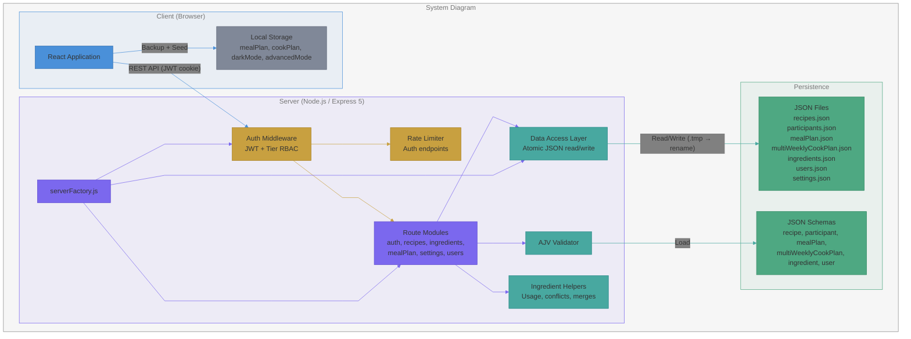
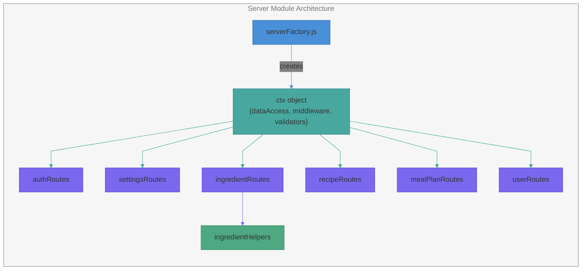

# System Architecture

High-level system diagram and application component hierarchy.

## System Diagram



## Component Hierarchy

```mermaid
---
config:
  theme: base
  flowchart:
    curve: linear
  themeVariables:
    lineColor: "#c8a0b0"
    primaryBorderColor: "#c8a0b0"
    edgeLabelBackground: "#808080"
    textColor: "#777777"
    titleColor: "#777777"
---
flowchart TD
    subgraph ComponentHierarchy["Component Hierarchy"]
        App["App.tsx"]:::blue --> AuthCheck{"Authenticated?"}:::amber
        AuthCheck -->|No| Login[Login]:::red
        AuthCheck -->|Yes| AppProvider["AppProvider<br/>(userTier, canEdit, unitSystem,<br/>advancedMode, darkMode)"]:::blue

        AppProvider --> Nav[Navigation]:::slate
        AppProvider --> ViewRouter{"View Router"}:::amber

        ViewRouter --> RV[RecipeView]:::purple
        ViewRouter --> Cal[Calendar]:::purple
        ViewRouter --> WP[WeeklyPlanner]:::purple
        ViewRouter --> SL[ShoppingList]:::purple
        ViewRouter --> Ing[Ingredients]:::purple
        ViewRouter --> Part[Participants]:::purple
        ViewRouter --> Admin["AdminPanel<br/>(Admin only)"]:::purple

        App --> RM["RecipeModal (global)"]:::teal
        App --> CD["ConfirmationDialog (global)"]:::teal

        RM --> RMView[RecipeViewMode]:::teal
        RM --> RMEdit[RecipeEditForm]:::teal
        RM --> RMJson[RecipeJsonEditor]:::teal
        RMView --> VideoEmbed[VideoEmbed]:::slate

        WP --> PH[PlannerHeader]:::slate
        WP --> Sidebar[WeeklyRecipesSidebar]:::slate
        WP --> DC[DayColumn]:::slate
        WP --> QAM[QuickAddRecipeModal]:::teal
        WP --> LPM[LeftoverPromptModal]:::teal
        WP --> RP[RecipePicker]:::teal
        DC --> MSC[MealSlotCard]:::slate
        DC --> PP1[ParticipantProgress]:::green
        Sidebar --> WRC[WeeklyRecipeCard]:::slate

        Cal --> PP2[ParticipantProgress]:::green

        Ing --> IngCard[IngredientCard]:::slate
        Ing --> IngEdit[IngredientEditForm]:::teal
        Ing --> IngMerge[IngredientMergeDialog]:::teal
        Ing --> IngDetail[IngredientDetailPopup]:::teal

        Admin --> MacroLimits[MacroLimitsSection]:::slate
        Admin --> CreateUser[CreateUserModal]:::teal
    end

    classDef blue fill:#4A90D9,stroke:#3570B0
    classDef purple fill:#7B68EE,stroke:#5B48CE
    classDef teal fill:#48A8A0,stroke:#288888
    classDef amber fill:#C8A040,stroke:#A88020
    classDef green fill:#4EA882,stroke:#308862
    classDef red fill:#C86060,stroke:#A84040
    classDef slate fill:#808898,stroke:#606878

    style ComponentHierarchy fill:#88888814,stroke:#888888

    linkStyle 0 stroke:#4A90D9
    linkStyle 1 stroke:#C8A040
    linkStyle 2 stroke:#C8A040
    linkStyle 3 stroke:#4A90D9
    linkStyle 4 stroke:#4A90D9
    linkStyle 5 stroke:#C8A040
    linkStyle 6 stroke:#C8A040
    linkStyle 7 stroke:#C8A040
    linkStyle 8 stroke:#C8A040
    linkStyle 9 stroke:#C8A040
    linkStyle 10 stroke:#C8A040
    linkStyle 11 stroke:#C8A040
    linkStyle 12 stroke:#4A90D9
    linkStyle 13 stroke:#4A90D9
    linkStyle 14 stroke:#48A8A0
    linkStyle 15 stroke:#48A8A0
    linkStyle 16 stroke:#48A8A0
    linkStyle 17 stroke:#48A8A0
    linkStyle 18 stroke:#7B68EE
    linkStyle 19 stroke:#7B68EE
    linkStyle 20 stroke:#7B68EE
    linkStyle 21 stroke:#7B68EE
    linkStyle 22 stroke:#7B68EE
    linkStyle 23 stroke:#7B68EE
    linkStyle 24 stroke:#808898
    linkStyle 25 stroke:#808898
    linkStyle 26 stroke:#4EA882
    linkStyle 27 stroke:#808898
    linkStyle 28 stroke:#4EA882
    linkStyle 29 stroke:#7B68EE
    linkStyle 30 stroke:#7B68EE
    linkStyle 31 stroke:#7B68EE
    linkStyle 32 stroke:#7B68EE
    linkStyle 33 stroke:#7B68EE
    linkStyle 34 stroke:#808898
    linkStyle 35 stroke:#808898
```

## Server Module Architecture


