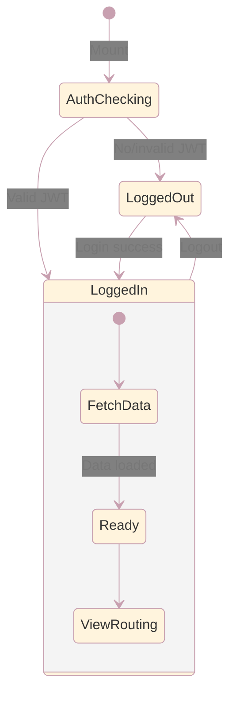

# Main Application

Root application component, authentication flow, context provider, and view routing.

## App (`src/App.tsx`)

The root component that orchestrates authentication, data loading, context provision, and view routing.

### Authentication Flow

On mount, `App` calls `GET /api/me` to check for an existing JWT session:

- **Authenticated**: Sets `user` and `userTier`, fetches recipes, participants, ingredients, and settings
- **Unauthenticated**: Renders the `Login` component
- **Test mode**: Bypasses auth check for testing

### AppContext / AppProvider

Once authenticated, `App` wraps its children in `AppProvider` which provides shared state via React Context:

| Context Value  | Type                                | Source           |
|----------------|-------------------------------------|------------------|
| `userTier`     | `'Viewer' \| 'Editor' \| 'Admin'`  | Auth response    |
| `canEdit`      | `boolean`                           | `tier !== 'Viewer'` |
| `unitSystem`   | `'metric' \| 'imperial' \| 'both'` | `useUIState`     |
| `advancedMode` | `boolean`                           | `useUIState`     |
| `darkMode`     | `boolean`                           | `useUIState`     |

Components access these values via `useAppContext()` instead of prop drilling.

### View Router

`App` renders one view at a time based on the `view` state from `useUIState`:

| View           | Component        | Access     |
|----------------|------------------|------------|
| `recipes`      | `RecipeView`     | All users  |
| `calendar`     | `Calendar`       | All users  |
| `weekly`       | `WeeklyPlanner`  | All users  |
| `shopping`     | `ShoppingList`   | All users  |
| `ingredients`  | `Ingredients`    | All users  |
| `participants` | `Participants`   | All users  |
| `admin`        | `AdminPanel`     | Admin only |

### Hooks Used

| Hook               | Purpose                                    |
|--------------------|--------------------------------------------|
| `useRecipes`       | Recipe CRUD                                |
| `useParticipants`  | Participant CRUD                           |
| `useMealPlan`      | Meal plan and cook plan sync               |
| `useIngredients`   | Ingredient CRUD and alias operations       |
| `useUIState`       | View state, theme, units, settings         |
| `useRecipeFilters` | Recipe search, filter, sort                |
| `useConfirmation`  | Global confirmation dialog state           |

### Global Modals

Two modals are rendered at the `App` level and shared across views:

- **RecipeModal**: Opened when `selectedRecipeData` is set; used by `RecipeView`, `Calendar`, `WeeklyPlanner`, and
  `ShoppingList`
- **ConfirmationDialog**: Opened via `useConfirmation`; used for delete confirmations and destructive actions

### Key Methods

| Method                   | Description                                                    |
|--------------------------|----------------------------------------------------------------|
| `saveRecipe`             | Save recipe via `useRecipes`, then update meal plan references |
| `removeRecipe`           | Delete recipe with confirmation dialog                         |
| `removeRecipes`          | Bulk delete selected recipes                                   |
| `handleSaveParticipants` | Save participants with success notification                    |
| `handleLogout`           | POST `/api/logout`, clear user state                           |
